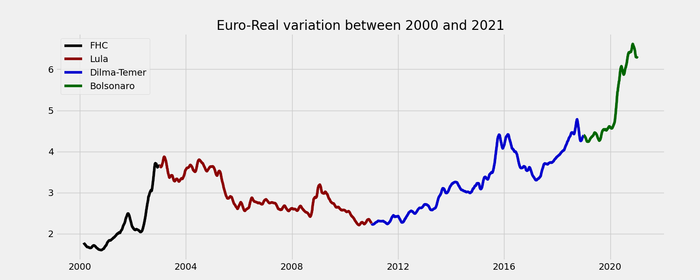
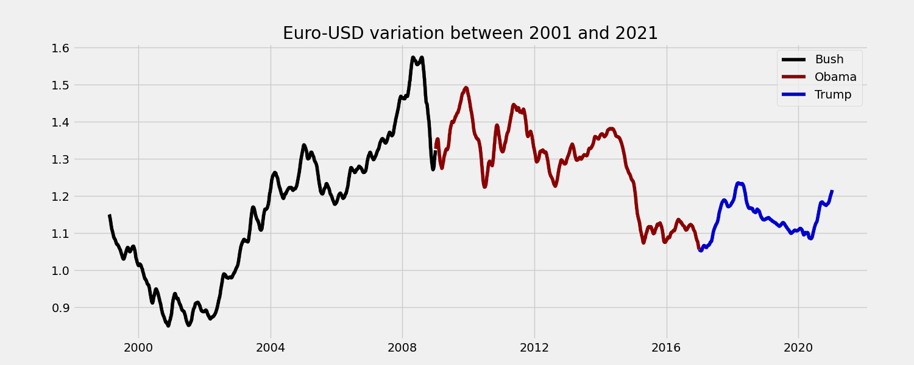

# Storytelling Data Visualization on Exchange Rates
Este repositório tem como objetivo divulgar os resultados encontrados durante a análise de dados em cima do Projeto Guiado [Storytelling Data Visualization and Information Design](https://app.dataquest.io/course/storytelling-information-design) do Dataquest.

A base de dados utilizada é a Europe Central Back que possui um conjunto de dados com a variação do euro em relação a várias outras moedas. Assim foi possível fazer a análise em relação ao Brasil e Estados Unidos e verificar a variação em cada governo diferente.

Abaixo temos alguns dos resultados em destaque.

### Alterações no Câmbio de Euro para Real ao longos dos últimos governos brasileiros



### Alterações no Câmbio de Euro para Dolar ao longos dos últimos governos americanos



## Tools

* Python3
* Pandas
* Jupyter Notebook
* Pylint

## Hands On
To run the project, just install pylint and run the script that calculates the score.

```shell
$ pip install -r requirements.py

$ python exchange_analyses.py
```

## Authors
- [Mateus Bastos](https://github.com/eluire)
- [Rafael Garcia](https://github.com/rafagarcia2)
